# The Coffee Bar, stop by stop — a guided tour of the shipped demo

Sigma AI ships with a complete worked project: a campus coffee bar where
espresso orders averaged **8.4 minutes** from register to handoff during the
weekday 7:00–10:00 peak, against a customer's 5-minute line. This walkthrough
tours that project in twelve stops. At each stop: what the screen shows, the
method point it teaches, and the honest-number moment — the place where the
suite tells you something a flattering tool wouldn't.

**Provenance of these screenshots.** The demo's artifacts live in
[`demo/coffee-bar/`](../demo/coffee-bar/) as the engine's own JSON — the same
files the CI golden-replay re-posts to prove the live engine still computes
the same numbers. The images below were captured by
[`desktop/tools/screenshots.mjs`](../desktop/tools/screenshots.mjs), which
seeds a scratch project from those exact files and drives the real app
against a live engine — every verdict on screen was computed at capture time,
not pasted in. Two staging notes so nothing misleads: version badges read
higher than v1 where the script re-saved an artifact through the UI to make
the prescore render, and stop 9's "Save failed" top-bar state is real — it is
the engine refusing the save, which is the point of that stop. Fishbone card
positions were seeded (the shipped JSON stores content, not canvas layout).

A demo video is not part of this repo; this walkthrough plus the
screenshots are the stand-in.

## Define — frame the problem without smuggling in the fix

### Stop 1 — the Project Picker: is this a good first project?

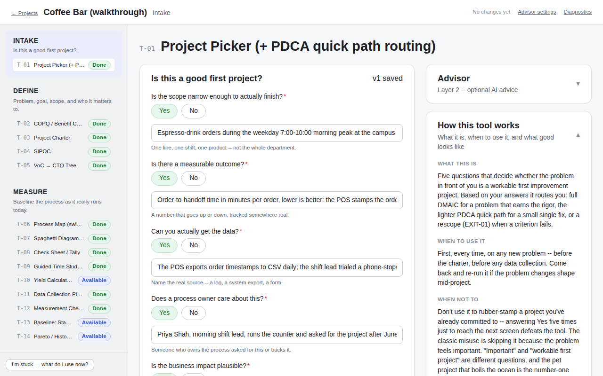

**What you see:** five plain-English criteria — scoped narrow, measurable
outcome, data obtainable, an engaged process owner, plausible business impact
— each answered Yes *with written evidence*, and the route set to full DMAIC.

**The method point:** the classic first failure isn't bad statistics, it's a
bad pick — the pet project, the boil-the-ocean project. The picker forces the
five questions before any DMAIC work opens, and small problems get routed to
a lightweight PDCA quick path instead of full ceremony.

**The honest moment:** every Yes needs its evidence line. "The owner cares"
doesn't count; "the bar's owner asked for this after the Q2 complaint log"
does.

### Stop 2 — the flawed charter draft, caught in the act

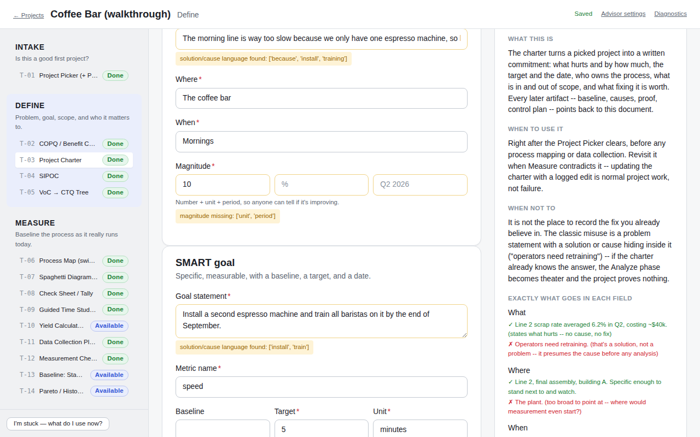

**What you see:** the demo's deliberately flawed first draft. The problem
statement — "The morning line is way too slow **because** we only have one
espresso machine…" — wears a flag: *solution/cause language found:
['because', 'install', 'training']*. The magnitude says "10 %" with no unit
or period behind it, and the goal is literally the fix ("**Install** a second
espresso machine and **train** all baristas…") with a vague metric ("speed").
The right rail shows a good and a bad example for the exact field you're in.

**The method point:** a problem statement states what, where, when, and how
much — never why and never the fix. If the charter already knows the answer,
Analyze becomes theater.

**The honest moment:** these are rule-based checks (keyword heuristics), and
the app says so — they flag for a second look rather than pretending to
understand the sentence. The deeper read is the advisor's job.

### Stop 3 — the corrected charter, clean

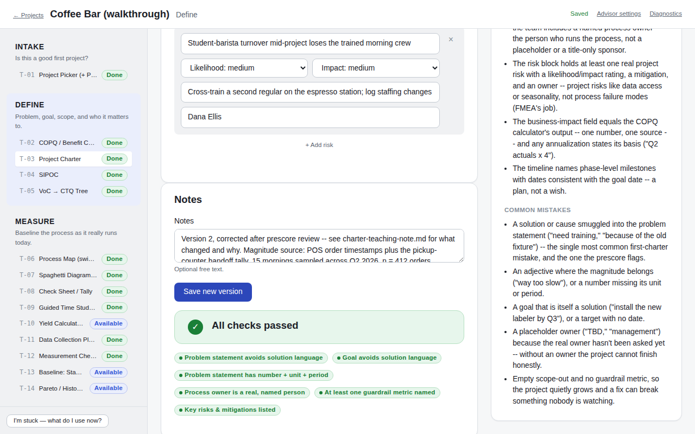

**What you see:** the shipped corrected charter's tail end: **"All checks
passed"** with every prescore pill green, a real key-risk row (barista
turnover — likelihood, impact, mitigation, and a named owner), and the
version note stating exactly what changed and where the magnitude number
comes from ("POS order timestamps plus the pickup-counter handoff tally, 15
mornings sampled across Q2 2026").

**The method point:** the corrected document states a measured 8.4-minute
average with its period, a 5.0-minute target with a date, and $16,084/yr
with its basis — magnitude traceable to data, goal SMART in substance, no
cause anywhere. The demo ships the flawed and corrected pair on purpose
([`charter-teaching-note.md`](../demo/coffee-bar/define/charter-teaching-note.md)
names each flaw): seeing the mistake is half the teaching.

**The honest moment:** artifacts version on edit — the flawed draft stays in
the project's history with a note pointing at what changed, rather than
being quietly overwritten.

## Measure — check the yardstick, then face the baseline

### Stop 4 — the measurement check that licenses everything after it

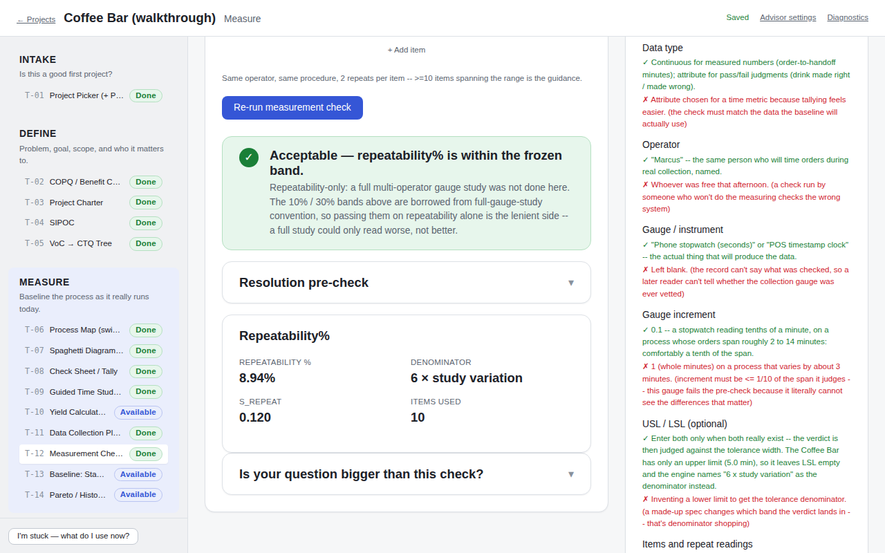

**What you see:** T-12's verdict: **Acceptable — repeatability 8.94%**, from
a blind test/retest of the timing method (10 items, s_repeat 0.120,
denominator named as 6 × study variation), after a resolution pre-check
(tenths of a minute on a ~5-minute span).

**The method point:** measure the measurement system before trusting any
number it produces. A failed check here *blocks capability language
downstream* — the engine renders results as unreliable until the gauge is
fixed (that refusal is a hard gate, and one of the eval scenarios exists
specifically to prove it fires).

**The honest moment:** the green banner itself hedges, correctly:
"Repeatability-only: a full multi-operator gauge study was not done here…
passing on repeatability alone is the lenient side." The tool names what it
checked and what it structurally cannot see (reproducibility), instead of
borrowing a bigger study's authority.

### Stop 5 — the baseline, part one: is the process stable?

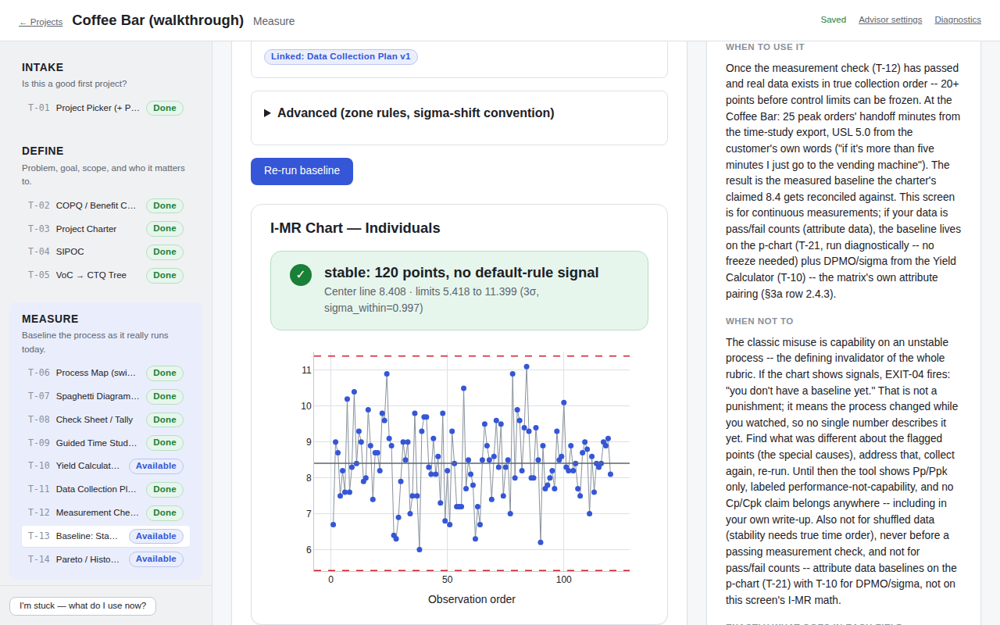

**What you see:** the wait-times dataset (120 orders over 10 mornings) run
through T-13 with the customer's 5.0 as the upper spec limit: an I-MR chart
and the verdict **"stable: 120 points, no default-rule signal"** — center
line 8.408, control limits 5.418 to 11.399.

**The method point:** stability comes before capability because the math
requires it — capability indices assume a process that is predictable. The
screen enforces the order: spec limits and a confirmed operational
definition before anything runs.

**The honest moment:** stable is not good. Stable means *this is what the
process reliably does* — which sets up part two.

### Stop 6 — the baseline, part two: stable, and not capable

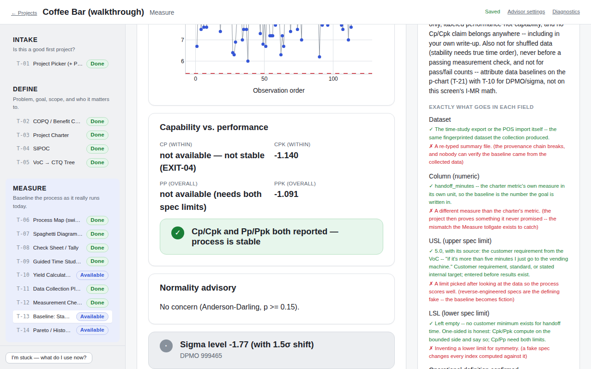

**What you see:** the capability panel for the same run: **Cpk −1.14**
(within), Ppk −1.09 (overall), a normality advisory with no concern, and a
sigma level of −1.77 (with the 1.5σ shift convention named on the number) at
DPMO 999,465.

**The method point:** a negative Cpk means the process *average* sits on the
wrong side of the spec limit — essentially every order blows past the
5-minute line. The 8.4 minutes is not a bad day; it's what this process is
built to produce. That hands Analyze its exact question: which common causes
drive it?

**The honest moment:** Cp and Pp render as "not available" because only one
spec limit exists — the tool computes the one-sided indices it can defend
and says why the others are absent, rather than inventing a lower limit to
fill the cells.

## Analyze and Improve — causes with evidence, one change at a time

### Stop 7 — the fishbone: opinions don't get verified

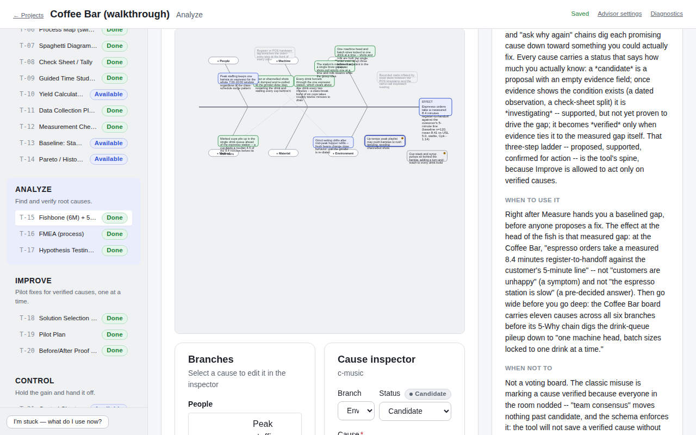

**What you see:** the full cause board — eleven causes across all six M
branches, color-coded by status, with the 5-Why chain stepping from the
drink-queue pileup down to the root: one machine head, batch sizes locked to
one drink at a time. The inspector shows a still-candidate cause (the peak
playlist theory) wearing its **"no evidence yet"** chip.

**The method point:** every cause carries a status ladder — candidate →
investigating → verified — and moving up requires an evidence pointer (the
check-sheet split, a dated observation). Ruled-out causes stay on the board
*with their evidence*, so the dead ends stay visible.

**The honest moment:** the schema itself refuses a cause marked verified with
no evidence attached — that's a 422 from the engine, not a style suggestion.
Improve is only allowed to act on verified causes.

### Stop 8 — the hypothesis test that ruled something out

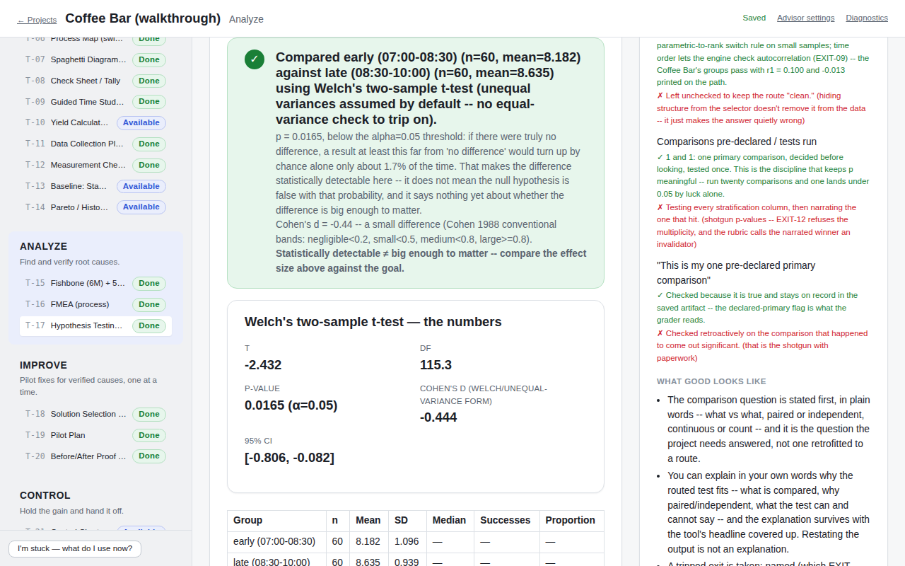

**What you see:** the daypart question — are late-morning waits different
from early-morning? — routed by the visible decision tree to Welch's t, with
the result in plain English: late mornings run about 0.45 minutes slower
(p = 0.0165, d = −0.44, CI −0.81 to −0.08), followed by a paragraph saying
what the p-value does and does not mean.

**The method point:** state the question, let the tree pick the test, and
always read effect size and interval alongside p — statistically detectable
and practically decisive are different sentences. The daypart effect is real
but minor: even the early window averages 8.18 against the 5.0 promise, so
daypart shuffling is *not* the driver, and the verified-cause list stays the
Improve queue.

**The honest moment:** a result that rules your theory *out of the driver's
seat* renders exactly like a positive finding — and the demo keeps it, dead
end and all, because that comparison spent the project's one pre-declared
Analyze test honestly.

### Stop 9 — the pilot plan says no: EXIT-10, one change at a time

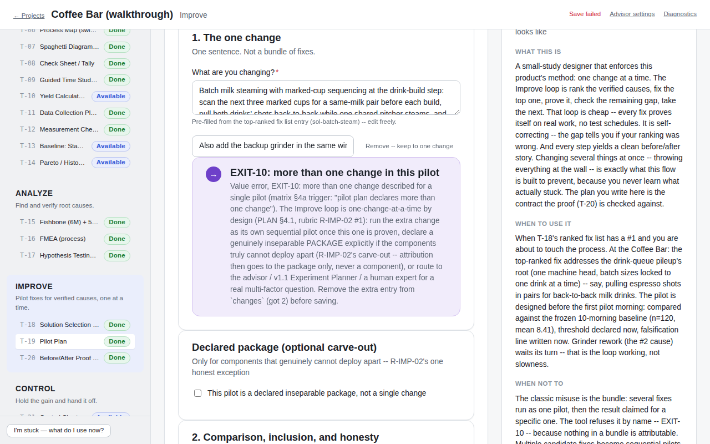

**What you see:** the round-1 pilot (the $40 batch-steam + marked-cup method
change) with a second change typed in — "also add the backup grinder in the
same window" — and the engine's answer: a named refusal, **EXIT-10: more
than one change in this pilot**, citing the frozen trigger, explaining the
routes out (run it as its own next pilot; declare a genuinely inseparable
package; or take a real multi-factor question to the advisor / the v1.1
Experiment Planner / a human expert). The top bar honestly reads "Save
failed" — no version was written.

**The method point:** the Improve loop is one change at a time by design —
bundle two fixes and you never learn what stuck. The refusal is a 422 from
the engine's schema, not advice.

**The honest moment:** the one carve-out (a declared inseparable package) is
itself honesty-shaped: attribution then belongs to the package as a whole,
never to a single component — which is exactly how the demo's round 2 runs.

### Stop 10 — the proof does the loop's arithmetic

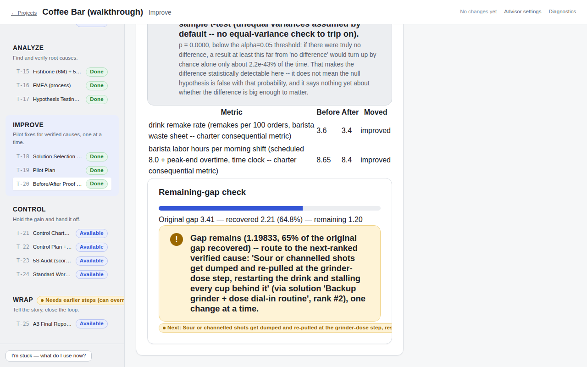

**What you see:** round 1's before/after proof: the guardrail metrics
(remake rate 3.6 → 3.4 per 100 orders, labor hours 8.65 → 8.4) both moved
the right way; the **remaining-gap check** — original gap 3.41 minutes,
recovered 2.21 (64.8%), **remaining 1.20** — and the routing card naming the
next-ranked verified cause (the grinder re-pull cause, via the
backup-grinder solution, rank #2), one change at a time.

**The method point:** the pilot landed at 6.198 minutes (n=120,
engine-verified stable) against a 7.0 threshold declared three days *before*
the window — a pilot proves itself against a pre-declared bar. And a good
result is not the end: the gap arithmetic tells you how much of the original
problem this fix actually recovered and hands you the next suspect. That
loop — fix, prove, re-check the gap, take the next cause — *is* the Improve
phase.

**The honest moment:** the plain-language p explanation under the t-test
says what p = 0.0000 does **not** mean, and the confounder answers print on
the proof itself. Round 2 (the declared grinder package) later lands at
4.899 with the fall-semester demand surge *declared as a confound that
weakens the verdict* — even though its direction could only have masked the
win.

## Control and Wrap — hold the gain, close honestly

### Stop 11 — the frozen control chart

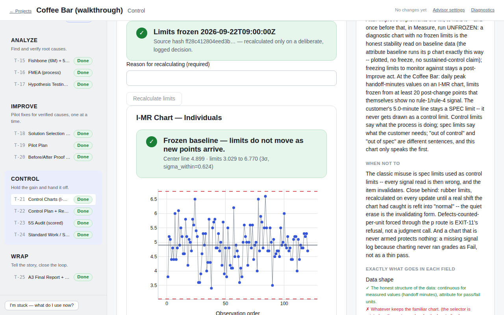

**What you see:** the I-MR chart frozen from the round-2 window: **"Limits
frozen 2026-09-22"** with the source-data hash on the banner, center line
4.899, limits 3.029 to 6.770, and the freeze rule stated on the chart —
limits do not move as new points arrive; recalculating requires a written
reason that gets logged.

**The method point:** control limits describe what the process *does*; the
customer's 5.0 stays a spec line and never gets drawn as a control limit —
they answer different questions. Frozen limits are what make drift visible;
rubber limits that re-fit every quarter quietly erase the signal.

**The honest moment:** the recalculate path demands a reason and keeps the
log — moving the goalposts is allowed only in writing.

### Stop 12 — the A3 closes on computed numbers

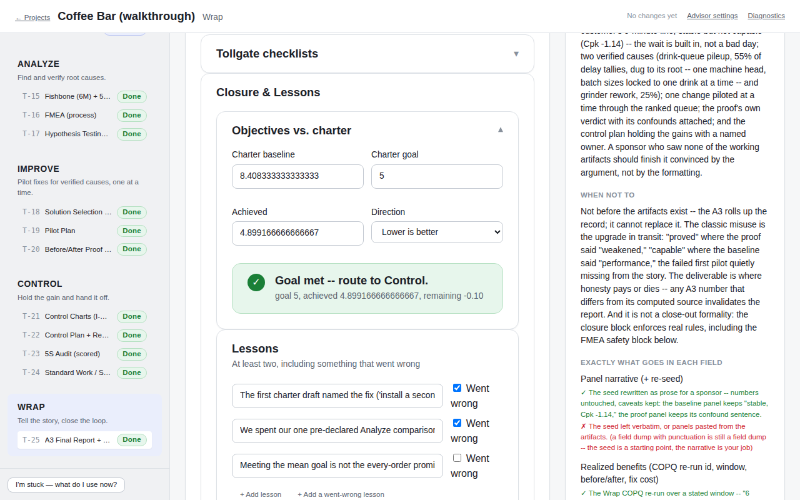

**What you see:** the A3's closure block: **"Goal met — route to Control.
goal 5, achieved 4.899…, remaining −0.10"** — the same gap arithmetic the
proof computed, not a hand-typed victory line. Below it, the lessons list
leads with what went wrong: the first charter draft that named the fix, and
the daypart comparison that dead-ended.

**The method point:** the A3 rolls the record up panel by panel, each seeded
from its source artifact and rewritten as narrative — with no claim upgraded
in transit: the realized-benefits panel reports $984.28 realized over a
stated 4-week window ($624.28 net of what the fixes cost), and the yearly
figure is labeled a projection with its basis, never presented as money
already in hand.

**The honest moment:** the project closes with its biggest open item stated
on the record — the *mean* promise was met, the *every-order* promise was
not (capability at the moment of maximum good news: Cpk 0.054, roughly 44%
of orders still modeled over the 5-minute line) — and the close check runs
live against the FMEA's severity blocks and every saved artifact's standing
hard flags before "closed" is allowed to stick.

---

**Where to go next:** the demo's own README
([`demo/coffee-bar/README.md`](../demo/coffee-bar/README.md)) tells the same
story file by file with every number's provenance; the Print Shop demo
([`demo/print-shop/README.md`](../demo/print-shop/README.md)) covers the
attribute-data path (p-charts, kappa, two-proportion z); and the
[architecture writeup](architecture.md) explains the machinery that kept all
of these numbers honest.
